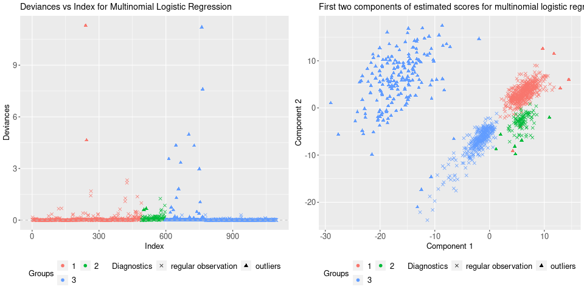

# enetLTS: Robust and Sparse Methods for High Dimensional Linear and Binary and Multinomial Regression

## Summary

`enetLTS` is an `R` package that provides a fully robust version of 
elastic net estimator for high dimensional linear and binary and multinomial regression. 
The elastic net penalization provides 
intrinsic variable selection and coefficient estimates for highly correlated 
variables in particular for high-dimensional low sample size 
data sets, and it has been extended to generalized linear regression models 
([Friedman et al., 2010](https://www.jstatsoft.org/article/download/v033i01/361)). 
Combining these advantages with trimming idea yields the robust solutions.
The main idea of the algorithm is to search for outlier-free subsets on which the classical elastic 
net estimator can be applied. Outlier-free subsets are determined by trimming 
the penalized log-likelihood function belonging to the regression model. 
The algorithm starts with 500 elemental subsets
only for one combination of $\alpha$ and $\lambda$, and takes the *warm start* strategy
for subsequent combinations in order to save the computation time.
The final reweighting step is added to improve the statistical 
efficiency of the proposed methods. 
From this point of view, the enet-LTS estimator can be seen as trimmed version 
of the elastic net regression estimator for linear, binary and multinomial 
regression ([Friedman et al., 2010](https://www.jstatsoft.org/article/download/v033i01/361)). 
Selecting optimal model with optimal tuning parameters is done via cross-validation, 
and various plots are available to illustrate model and to evaluate the 
final model estimates. 

## Implemented Methods 

- `enetLTS()`: elastic net trimmed squared regression for families:

   1- `gaussian`

   2- `binomial`
   
   3- `multinomial`
                                                                  

## Installation

Package `enetLTS` is on CRAN (The Comprehensive `R` Archive Network), hence the latest release can be easily installed from the `R` command as follows

```R
> install.packages("enetLTS")
```

## Building from source

To install the latest (possibly unstable) version from GitHub, you can pull this repository and install it from the `R` command line as follows

```R
> install.packages("devtools")
> devtools::install_github("fatmasevinck/enetLTS")
```

If you already have package `devtools` installed, the first line can be skipped.


# Example: Robust and Sparse Linear Regression

We have considered the [NCI-60 cancer cell panel](https://discover.nci.nih.gov/cellminer/) data in order to illustrate the functionality of the `enetLTS` model for linear regression. As in ([Alfons, 2021](https://joss.theoj.org/papers/10.21105/joss.03786)), the response variable is determined by the protein expressions for a specific protein, which is 92th protein, and
the explanatory variable is determined by the gene expressions of the 100 genes that have the highest (robustly estimated) correlations with the response variable. This data set is available in package `robustHD`.

```R
> # load data
> library("robustHD")
> data("nci60")  # contains matrices 'protein' and 'gene'

> # define response variable
> y <- protein[, 92]
> # screen most correlated predictor variables
> correlations <- apply(gene, 2, corHuber, y)
> keep <- partialOrder(abs(correlations), 100, decreasing = TRUE)
> X <- gene[, keep]
```

Like many other packages, the easy way to use the package `enetLTS` is to install it directly from `CRAN`. 

```R
> # install and load package
> install.packages("enetLTS")
> library(enetLTS)
> # fit the model for family="gaussian"
> fit.gaussian <- enetLTS(X,y)
> [1] "optimal model: lambda = 0.1391 alpha = 0.6"
>
> fit.gaussian
enetLTS estimator 

Call:  enetLTS(xx = X, yy = y, family = "gaussian", alphas = alphas, lambdas = lambdas, lambdaw = NULL, intercept = TRUE, scal = TRUE, 
 hsize = 0.75, nsamp = 500, nCsteps = 20, nfold = 5, repl = 1, ncores = 1, tol = -1e+06, seed = NULL, crit.plot = TRUE) 


Coefficients:
          1           2           3           4           5           6           7           8           9          10          11          12 
-2.52390658  0.31135509  0.00000000  0.00000000  0.12285091  0.00000000  0.00000000  0.00000000  0.00000000  0.07457828  0.00000000  0.00000000 
         13          14          15          16          17          18          19          20          21          22          23          24 
 0.09740240  0.00000000  0.00000000  0.00000000  0.00000000  0.00000000  0.00000000  0.00000000  0.00000000  0.00000000  0.00000000  0.05946501 
         25          26          27          28          29          30          31          32          33          34          35          36 
-0.27371935  0.00000000  0.00000000  0.00000000 -0.07528489  0.00000000  0.00000000  0.00000000  0.13028362  0.00000000  0.00000000  0.00000000 
         37          38          39          40          41          42          43          44          45          46          47          48 
 0.00000000  0.00000000  0.12902065 -0.02704781  0.00000000  0.00000000  0.00000000  0.00000000  0.00000000  0.00000000  0.00000000  0.00000000 
         49          50          51          52          53          54          55          56          57          58          59          60 
 0.00000000  0.00000000  0.00000000  0.00000000  0.00000000  0.00000000  0.00000000  0.00000000  0.00000000  0.00000000  0.00000000  0.00000000 
         61          62          63          64          65          66          67          68          69          70          71          72 
 0.00000000  0.00000000  0.00000000  0.00000000  0.00000000  0.00000000  0.06071918  0.00000000  0.10203048  0.00000000  0.00000000  0.00000000 
         73          74          75          76          77          78          79          80          81          82          83          84 
 0.09639756  0.00000000  0.00000000  0.00000000  0.00000000  0.00000000  0.00000000  0.00000000 -0.03343054  0.00000000  0.00000000  0.00000000 
         85          86          87          88          89          90          91          92          93          94          95          96 
 0.00000000 -0.08272298  0.00000000 -0.09226326  0.00000000  0.00000000  0.00000000  0.17930052  0.00000000  0.00000000  0.09609275 -0.10894526 
         97          98          99         100         101 
 0.00000000  0.00000000  0.04865659  0.00000000  0.00000000 

 number of the nonzero coefficients:
[1] 21

 alpha: 0.725
 lambda: 0.1391
 lambdaw: 0.07936752

 number of the nonzero coefficients:
[1] 29

 alpha: 0.6
 lambda: 0.1391
 lambdaw: 0.07545663
```

`enetLTS()` 

The combination of the optimal tuning parameters is defined by 5-fold cross-validation based on 
certain grids for $\alpha$ and $\lambda$. 
Evaluation criterion for 5-fold cross-validation is summarized by heatmap for users if the arguman 
is chosen as `crit.plot="TRUE"`.


Several plots are available for the results: `plotCoef.enetLTS()` visualizes the coefficients, 
`plotResid.enetLTS()` plots the values of residuals vs fitted values, 
and `plotDiagnostic.enetLTS()` allows to produce various diagnostic
plots for the final model fit. 


Examples of the residuals plot (left) and the diagnostic plot (right) for output of function 
`enetLTS()` with the arguman `family="gaussian"`.

# Example: Robust and Sparse Binary Regression 

# Example: Robust and Sparse Multinomial Regression

The fuit data set has been well-known in the context of robust discrimination. 
It contains spectral information with 256 wavelengths,
thus is high-dimensional, for observations from 3 different cultivars of the same fruit, named
D, M, and HA, with group sizes 490, 106, and 500. 

```R
> # load data
> library(rrcov)
> data(fruit)
> 
> d <- fruit[,-1]  # first column includes the fruid names 
> X <- as.matrix(d)
> # define response variable
> grp <- c(rep(1,490),rep(2,106),rep(3,500)) 
> y <- factor(grp-1)
>
> set.seed(123)
> fit.multinom <- enetLTS(X, y, family="multinomial",
+                    alphas=seq(from=0.01,to=0.1,by=0.01), 
+                    lambdas=seq(from=0.01,to=0.1,by=0.01),
+                    lambdaw=NULL, intercept=TRUE, hsize=0.75, 
+                    nsamp=c(500,10), nCsteps=20, nfold=5, repl=1, ncores=1, 
+                    tol=-1e6, scal=TRUE, seed=NULL, crit.plot=TRUE)
> [1] "optimal model: lambda = 0.01 alpha = 0.02"
> 
> fit.mutinom 
enetLTS estimator 

Call:  enetLTS(xx = xx, yy = yy, family = "multinomial", alphas = alphas,      lambdas = lambdas, lambdaw = NULL, intercept = TRUE, scal = TRUE,      hsize = 0.75, nsamp = c(500, 10), nCsteps = 20, nfold = 5,      repl = 1, ncores = 1, tol = -1e+06, seed = NULL, crit.plot = TRUE) 


Coefficients:
$`1`
           class1        class2        class3
1    2.7962253887  6.7529902637 -7.6910690530
2   -0.2593751542 -1.4027829696  1.7598332134
3    0.3775465377 -0.8984986707  0.4202517155
4    0.7066047618 -1.3478633172  0.5548469549
5   -3.0262227628  0.3879219598  2.5552004548
6   -2.5902303222  0.7943801558  1.7083742240
7   -1.8754419810  0.1816701593  1.6040002012
8   -0.4052527413 -0.3686101009  0.8596821851
9   -3.4611180589  1.5055523865  1.8718946223
10  -0.4987077487 -0.0535660851  0.6534636570
11  -0.0257654868 -0.2159852131  0.3208728697
12  -2.1613782188  0.0000000000  2.2258827577
13  -0.7325710773 -0.5471757311  1.3664641225
14  -1.8718226874  0.1038770653  1.6769558412
15  -2.4933431563  0.7919784239  1.6110377603
16   0.7047579527 -1.0372514718  0.2377595195
17  -0.6140012551 -0.4295144314  1.1218281923
18  -2.1597577251  0.2813565409  1.8007426133
19  -4.4350672167  3.5850126819  0.7662496934
20   1.7666686513 -1.7759928846  0.0000000000
21   0.0000000000 -0.4916549702  0.4106071942
22  -0.9321995561 -0.5735099659  1.5849590969
23  -0.9365850370 -0.1363059683  1.1527982292
24  -1.2891400830  1.6338275348 -0.2618267342
25   0.0298118632 -1.1592781119  1.0477595934
26   2.6273452659 -2.0613851537 -0.4792902714
27   0.7175396338 -1.2391260290  0.4371787453
28  -1.7248354438  1.4219685563  0.2227269032
29  -0.7235180459  0.2592669638  0.3830251716
30   0.2375035311  1.0075598885 -1.3257639638
31   1.4344107589 -0.2480212066 -1.1058745608
32   0.0000000000  0.1342504290 -0.0711414794
33   0.2159089204 -0.0821667624 -0.0582154915
34   0.5473201751 -0.4227095760 -0.0495778299
35   0.5806706713 -0.1227883876 -0.3844554041
36   0.5614062059  0.0000000000 -0.4942754747
37   0.4121320921  0.0000000000 -0.4732186321
38   0.8639475749 -0.1440064008 -0.6518355847
39  -0.2656923988  0.4425342483 -0.1088294593
40   0.8847615828 -0.3422788349 -0.4765346258
41   0.4869034920 -0.0696625373 -0.3498479149
42   0.5340535805 -0.1976843220 -0.2706217428
43   0.3417365543 -0.0169641954 -0.2583259102
44   0.1445993443  0.0000000000 -0.1971987100
45   0.2491952271  0.0000000000 -0.2958381506
46   0.1390018582  0.0000000000 -0.1463682710
47   0.2558278931  0.0000000000 -0.2358091006
48   0.4168440976 -0.0333519107 -0.3187742126
49   0.2707618711  0.0000000000 -0.2785724752
50   0.2161133700  0.0000000000 -0.1599770380
51   0.1952721380 -0.0005319644 -0.1297281918
52   0.1683127787  0.0000000000 -0.1599751518
53   0.0971066986  0.0080237143 -0.1704656128
54   0.2071595210  0.0000000000 -0.1622542797
55   0.2831204408 -0.0187021191 -0.1989434094
56   0.2129688780  0.0000000000 -0.2111895297
57   0.2595160689 -0.0445664644 -0.1495659788
58   0.3227035264 -0.0781311709 -0.1787516928
59   0.2052215795  0.0000000000 -0.1645361267
60   0.1003195253  0.0000000000 -0.1263198727
61   0.1280915066 -0.0405212757 -0.0212154207
62   0.0316268968  0.0000000000 -0.0788105847
63   0.0000000000  0.0372874571 -0.0790124337
64   0.0502885490  0.0000000000 -0.0291065128
65   0.0000000000  0.0000000000  0.0000000000
66   0.0000000000  0.0000000000  0.0000000000
67  -0.0211106914  0.0000000000  0.0731999362
68  -0.0448813983  0.0000000000  0.1139426252
69  -0.0996250701 -0.0286913792  0.1978346044
70  -0.1170973198 -0.0816638929  0.2687019828
71  -0.0843481621 -0.0647812617  0.2199576013
72  -0.0810415941 -0.1603999425  0.3128020853
73  -0.0137636236 -0.2436933623  0.3296211674
74   0.0000000000 -0.3333091691  0.3860770387
75  -0.0006301308 -0.2781610407  0.3516451092
76  -0.0402869600 -0.2271086075  0.3405691427
77  -0.0286739779 -0.1945644246  0.2964860008
78  -0.0064184976 -0.2088435932  0.2888011089
79   0.0000000000 -0.2231104094  0.2797129850
80   0.0000000000 -0.2034545662  0.1955081976
81   0.0178923013 -0.2201721623  0.1270981230
82   0.0778690335 -0.1949720728  0.0415196514
83   0.1105323255 -0.2088804138  0.0225597522
84   0.0992363060 -0.2123870717  0.0372135934
85   0.0922876450 -0.1833155619  0.0148678599
86   0.1017756120 -0.1267464925  0.0000000000
87   0.0572848892 -0.0947090877  0.0000000000
88   0.0242475345 -0.0899690674  0.0000000000
89   0.0378020214 -0.0762105294  0.0000000000
90   0.0130600479 -0.0909129808  0.0006209133
91   0.0126789885 -0.0531668690  0.0000000000
92   0.0422915996 -0.0752573780  0.0000000000
93   0.0454754934 -0.0811894939  0.0000000000
94   0.0733651455 -0.0227849618  0.0000000000
95   0.1244594582 -0.0384495271 -0.0079679556
96   0.1441657481 -0.0083784817 -0.0575716106
97   0.1459085882 -0.0177592764 -0.0498858122
98   0.1339793815  0.0000000000 -0.1346845794
99   0.1283207835  0.0000000000 -0.1455810289
100  0.0848832735  0.0000000000 -0.1262518771
101  0.1089957730  0.0000000000 -0.1349513969
102  0.0574430058  0.0029637687 -0.1396381353
103  0.0071252112  0.0519673338 -0.1384496867
104  0.0000000000  0.0783245585 -0.1277378285
105  0.0000000000  0.1427011606 -0.2103146594
106  0.0166778989  0.1277915905 -0.2241249972
107  0.0349868272  0.1439472629 -0.2586371680
108  0.1123420404  0.1428785605 -0.3349159601
109  0.1369208463  0.1385487779 -0.3550399466
110  0.1898646712  0.1382475027 -0.4075458890
111  0.2177059653  0.1667316899 -0.4638451539
112  0.2469031490  0.1762787432 -0.5026609061
113  0.2814930651  0.1804090546 -0.5414947794
114  0.2525260208  0.1857293732 -0.5179712722
115  0.2686475109  0.1707249801 -0.5195125964
116  0.2517810325  0.1199431604 -0.4524625917
117  0.1939811989  0.0383414372 -0.3138210344
118  0.0941982385  0.0000000000 -0.1171915625
119  0.0000000000  0.0000000000  0.0000000000
120 -0.2852201020  0.0122394601  0.1873713664
121 -0.6504349634  0.1559035403  0.4065055095
122 -1.0668771400  0.3337166147  0.6421392540
123 -1.5072514641  0.5337070677  0.8789369688
124 -1.9326920853  0.7201858995  1.1137645214
125 -2.2965667559  0.8732241467  1.3199276571
126 -2.5609578945  0.9834764407  1.4690754245
127 -2.6688266936  1.0225370543  1.5328019087
128 -2.5822670464  0.9846114495  1.4794597700
129 -2.2873685311  0.8648501758  1.3005003853
130 -1.8531575500  0.7183957933  1.0100259137
131 -1.3412664949  0.5595677402  0.6552114244
132 -0.8429975904  0.4103812107  0.3049281564
133 -0.4261018552  0.2916172165  0.0058748276
134 -0.0878172449  0.2310356753 -0.0137451674
135  0.0007142593  0.1306826164 -0.2616764419
136  0.2444104645  0.0906942656 -0.4660842515
137  0.4164832653  0.0734907721 -0.6216251330
138  0.5364663235  0.0786585969 -0.7474288076
139  0.6440113776  0.0714458981 -0.8484381056
140  0.7082631226  0.0857900550 -0.9277142764
141  0.7830330695  0.0887260376 -1.0061452437
142  0.7972849797  0.1384793056 -1.0708986582
143  0.8449145374  0.1682445844 -1.1490646788
144  0.8840834057  0.2005474506 -1.2213152079
145  0.9183550064  0.2392320366 -1.2951703699
146  0.9567188235  0.3182838712 -1.4136048478
147  1.0461159937  0.3345088723 -1.5203075233
148  1.0402316755  0.3779200705 -1.5589512492
149  1.0931905524  0.3786713037 -1.6137724508
150  1.1167913510  0.4202309809 -1.6800272033
151  1.1334261181  0.4547126444 -1.7321032139
152  1.1242397383  0.4960511329 -1.7650365987
153  1.1398335526  0.5222282188 -1.8074224874
154  1.1054518144  0.5988541003 -1.8501003630
155  1.1001721957  0.6116063370 -1.8578626082
156  1.0794401330  0.6136941778 -1.8393073573
157  1.0200618658  0.6370236907 -1.8029685005
158  0.9574531173  0.6319059045 -1.7345158973
159  0.8638889689  0.6213505659 -1.6292552245
160  0.7616531293  0.6190571626 -1.5233250732
161  0.6895821901  0.5923550845 -1.4233590636
162  0.6384920430  0.5849542257 -1.3640414518
163  0.6129767874  0.5792166108 -1.3323055450
164  0.6141327267  0.5570410100 -1.3110657481
165  0.5979697565  0.5531153599 -1.2908924263
166  0.5982901927  0.5310454763 -1.2692028765
167  0.5916799671  0.5178849081 -1.2495809557
168  0.5902861871  0.5112635448 -1.2417340295
169  0.5930304523  0.4823382313 -1.2158128061
170  0.5948796757  0.4669021262 -1.2023925016
171  0.5724308719  0.4465066370 -1.1597439513
172  0.5555528981  0.4410628227 -1.1373677120
173  0.5287209799  0.4238275770 -1.0932256146
174  0.5111383427  0.3990377062 -1.0506267662
175  0.4853735035  0.3834977819 -1.0089963603
176  0.4647936052  0.3515667199 -0.9562059799
177  0.4467787017  0.3381638684 -0.9245333833
178  0.4262081365  0.3249125832 -0.8904338523
179  0.3797415965  0.3232629574 -0.8421751712
180  0.3975906620  0.2858587629 -0.8224525956
181  0.3551337713  0.2922728425 -0.7862999019
182  0.3595101676  0.2549751136 -0.7532638065
183  0.3383475942  0.2157699902 -0.6927510414
184  0.3075677824  0.1929361942 -0.6389194501
185  0.2632439713  0.1825297726 -0.5837564578
186  0.2084355983  0.1445154801 -0.4903101370
187  0.1230557927  0.1540614297 -0.4134550663
188  0.0622817281  0.1025002302 -0.2998666651
189  0.0000000000  0.0726636795 -0.2004652028
190  0.0000000000  0.0662075940 -0.0584366172
191 -0.1366851341  0.0642854899  0.0000000000
192 -0.3523025241  0.1038151621  0.1204597125
193 -0.5131629117  0.1185784941  0.2688178271
194 -0.6704307265  0.1757423105  0.3713637289
195 -0.7687978077  0.2027172561  0.4450034279
196 -0.8987449212  0.2702972558  0.5092171824
197 -1.0486124054  0.3276114700  0.6033182729
198 -1.2570733759  0.4223734657  0.7182532943
199 -1.4173438708  0.4820651412  0.8199430549
200 -1.5390184813  0.5085756991  0.9158355504
201 -1.6135247264  0.5030845228  0.9963390098
202 -1.6659504884  0.5477737639  1.0044086909
203 -1.7102082767  0.5538158156  1.0428442211
204 -1.6495559443  0.5390047459  0.9970925475
205 -1.6473118168  0.5137279048  1.0200360622
206 -1.5696933096  0.4590636741  0.9968351052
207 -1.5680102518  0.4862796375  0.9673860398
208 -1.5068476208  0.4215293961  0.9704001915
209 -1.4256860152  0.3692053829  0.9408805516
210 -1.3585842965  0.3106787656  0.9314137020
211 -1.2853390157  0.2336189887  0.9343754306
212 -1.1548020155  0.1247623797  0.9117664394
213 -1.0900225733  0.0904308456  0.8803921976
214 -0.9632486555  0.0102717949  0.8327724392
215 -0.7862792884  0.0000000000  0.8348765434
216 -0.6263677914 -0.0045850625  0.7532851738
217 -0.4526594940 -0.1066950254  0.6827112193
218 -0.2952121007 -0.1963826229  0.6159726089
219 -0.1626010664 -0.2331230328  0.5209837978
220 -0.0386683031 -0.2526693614  0.4175937209
221  0.0000000000 -0.2754508682  0.3463147952
222  0.0165091441 -0.3825548586  0.2379151637
223  0.2195623574 -0.4640960569  0.1154200096
224  0.3695822328 -0.4670191577  0.0000000000
225  0.4933238010 -0.5896649594  0.0000000000
226  0.7412456153 -0.6325803441  0.0000000000
227  0.8009040767 -0.6694512463  0.0000000000
228  0.9954373058 -0.8038692544 -0.0562966079
229  1.0900382506 -0.8608068913 -0.0926089434
230  1.1949544423 -1.0187170742 -0.0385092102
231  1.2940680842 -1.0840740713 -0.0713216837
232  1.3454649130 -1.0636558506 -0.1422390353
233  1.1851748154 -0.8607833646 -0.1841375321
234  1.4364382198 -1.0163257239 -0.2787825995
235  1.5359750652 -1.2943239643 -0.0995187041
236  1.5941370774 -1.2685752402 -0.1828147464
237  1.4355398123 -1.3159850933  0.0000000000
238  2.1402812026 -1.8375525815 -0.1595479753
239  1.3335126519 -1.3677116381  0.0000000000
240  1.2913826937 -0.8679510734 -0.2807677040
241  1.7398138388 -1.5862672583 -0.0105471819
242  1.0607187321 -0.9444272391  0.0000000000
243  1.2676287782 -1.1218761891 -0.0034615564
244  0.9134722897 -0.9595962367  0.0000000000
245  1.3826692689 -1.0473804764 -0.1930353611
246  1.1841653391 -1.0260127777 -0.0163824510
247  1.1452399597 -1.0977525283  0.0000000000
248  0.6438501316 -0.4193500535 -0.0834651441
249  0.8050253435 -0.6906726784  0.0000000000
250  2.1161752006 -1.7641849455 -0.2126781652
251  0.2713501025 -0.1271564866 -0.0053968587
252  0.1574992250  0.0000000000 -0.2725555050
253  0.7291072345  0.0031057350 -0.8682901366
254  0.2142565754 -0.1673101329  0.0000000000
255  1.0204454791 -0.4689838117 -0.4185970146
256  1.4067931125 -0.9518404322 -0.3243462917
257  0.6299966065  0.0000000000 -0.6472410097


 number of the nonzero coefficients:
[1] 704

 alpha: 0.02
 lambda: 0.01
 lambdaw: 0.003971358
  ```    


 
 
 
 
# References 

Friedman J., Hastie T. and Tibshirani R. (2010) Regularization paths for generalized linear 
models via coordinate descent. Journal of Statistical Software, 33(1), 1-22. DOI
[10.1163/ej.9789004178922.i-328.7](https://www.jstatsoft.org/article/download/v033i01/361)

Reinhold, W. C., Sunshine, M., Liu, H., Varma, S., Kohn, K. W., Morris, J., Doroshow, J., &
Pommier, Y. (2012). CellMiner: A web-based suite of genomic and pharmacologic tools to
explore transcript and drug patterns in the NCI-60 cell line set. Cancer Research, 72(14),
3499–3511. DOI
[10.1158/0008-5472.can-12-1370](https://pubmed.ncbi.nlm.nih.gov/22802077/)

A. Alfons (2021). robustHD: An R package for robust regression with high-dimensional data. 
Journal of Open Source Software, 6(67), 3786. DOI
[10.21105/joss.03786](https://joss.theoj.org/papers/10.21105/joss.03786)
