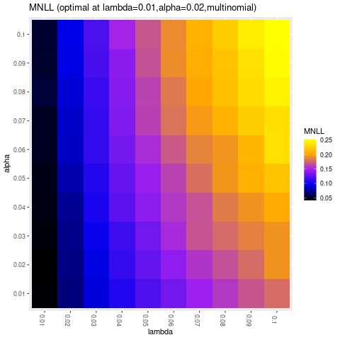

# enetLTS: Robust and Sparse Methods for High Dimensional Linear and Binary and Multinomial Regression

## Summary

`enetLTS` is an `R` package that provides a fully robust version of 
elastic net estimator for high dimensional linear and binary and multinomial regression. 
The elastic net penalization provides 
intrinsic variable selection and coefficient estimates for highly correlated 
variables in particular for high-dimensional low sample size 
data sets, and it has been extended to generalized linear regression models 
([Friedman et al., 2010](https://www.jstatsoft.org/article/download/v033i01/361)). 
Combining these advantages with trimming idea yields the robust solutions.
The main idea of the algorithm is to search for outlier-free subsets on which the classical elastic 
net estimator can be applied. Outlier-free subsets are determined by trimming 
the penalized log-likelihood function belonging to the regression model. 
The algorithm starts with 500 elemental subsets
only for one combination of $\alpha$ and $\lambda$, and takes the *warm start* strategy
for subsequent combinations in order to save the computation time.
The final reweighting step is added to improve the statistical 
efficiency of the proposed methods. 
From this point of view, the enet-LTS estimator can be seen as trimmed version 
of the elastic net regression estimator for linear, binary and multinomial 
regression ([Friedman et al., 2010](https://www.jstatsoft.org/article/download/v033i01/361)). 
Selecting optimal model with optimal tuning parameters is done via cross-validation, 
and various plots are available to illustrate model and to evaluate the 
final model estimates. 

## Implemented Methods 

- `enetLTS()`: elastic net trimmed squared regression for families:

   1- `gaussian`

   2- `binomial`
   
   3- `multinomial`
                                                                  

## Installation

Package `enetLTS` is on CRAN (The Comprehensive `R` Archive Network), hence the latest release can be easily installed from the `R` command as follows

```R
> install.packages("enetLTS")
```

## Building from source

To install the latest (possibly unstable) version from GitHub, you can pull this repository and install it from the `R` command line as follows

```R
> install.packages("devtools")
> devtools::install_github("fatmasevinck/enetLTS")
```

If you already have package `devtools` installed, the first line can be skipped.


# Example: Robust and Sparse Linear Regression

We have considered the [NCI-60 cancer cell panel](https://discover.nci.nih.gov/cellminer/) data in order to illustrate the functionality of the `enetLTS` model for linear regression. As in ([Alfons, 2021](https://joss.theoj.org/papers/10.21105/joss.03786)), the response variable is determined by the protein expressions for a specific protein, which is 92th protein, and
the explanatory variable is determined by the gene expressions of the 100 genes that have the highest (robustly estimated) correlations with the response variable. This data set is available in package `robustHD`.

```R
> # load data
> library("robustHD")
> data("nci60")  # contains matrices 'protein' and 'gene'

> # define response variable
> y <- protein[, 92]
> # screen most correlated predictor variables
> correlations <- apply(gene, 2, corHuber, y)
> keep <- partialOrder(abs(correlations), 100, decreasing = TRUE)
> X <- gene[, keep]
```

Like many other packages, the easy way to use the package `enetLTS` is to install it directly from `CRAN`. 

```R
> # install and load package
> install.packages("enetLTS")
> library(enetLTS)
> # fit the model for family="gaussian"
> fit.gaussian <- enetLTS(X,y)
> [1] "optimal model: lambda = 0.1391 alpha = 0.6"
>
> fit.gaussian
enetLTS estimator 

Call:  enetLTS(xx = X, yy = y, family = "gaussian", alphas = alphas, lambdas = lambdas, lambdaw = NULL, intercept = TRUE, scal = TRUE, 
 hsize = 0.75, nsamp = 500, nCsteps = 20, nfold = 5, repl = 1, ncores = 1, tol = -1e+06, seed = NULL, crit.plot = TRUE) 


Coefficients:
          1           2           3           4           5           6           7           8           9          10          11          12 
-2.52390658  0.31135509  0.00000000  0.00000000  0.12285091  0.00000000  0.00000000  0.00000000  0.00000000  0.07457828  0.00000000  0.00000000 
         13          14          15          16          17          18          19          20          21          22          23          24 
 0.09740240  0.00000000  0.00000000  0.00000000  0.00000000  0.00000000  0.00000000  0.00000000  0.00000000  0.00000000  0.00000000  0.05946501 
         25          26          27          28          29          30          31          32          33          34          35          36 
-0.27371935  0.00000000  0.00000000  0.00000000 -0.07528489  0.00000000  0.00000000  0.00000000  0.13028362  0.00000000  0.00000000  0.00000000 
         37          38          39          40          41          42          43          44          45          46          47          48 
 0.00000000  0.00000000  0.12902065 -0.02704781  0.00000000  0.00000000  0.00000000  0.00000000  0.00000000  0.00000000  0.00000000  0.00000000 
         49          50          51          52          53          54          55          56          57          58          59          60 
 0.00000000  0.00000000  0.00000000  0.00000000  0.00000000  0.00000000  0.00000000  0.00000000  0.00000000  0.00000000  0.00000000  0.00000000 
         61          62          63          64          65          66          67          68          69          70          71          72 
 0.00000000  0.00000000  0.00000000  0.00000000  0.00000000  0.00000000  0.06071918  0.00000000  0.10203048  0.00000000  0.00000000  0.00000000 
         73          74          75          76          77          78          79          80          81          82          83          84 
 0.09639756  0.00000000  0.00000000  0.00000000  0.00000000  0.00000000  0.00000000  0.00000000 -0.03343054  0.00000000  0.00000000  0.00000000 
         85          86          87          88          89          90          91          92          93          94          95          96 
 0.00000000 -0.08272298  0.00000000 -0.09226326  0.00000000  0.00000000  0.00000000  0.17930052  0.00000000  0.00000000  0.09609275 -0.10894526 
         97          98          99         100         101 
 0.00000000  0.00000000  0.04865659  0.00000000  0.00000000 

 number of the nonzero coefficients:
[1] 21

 alpha: 0.725
 lambda: 0.1391
 lambdaw: 0.07936752

 number of the nonzero coefficients:
[1] 29

 alpha: 0.6
 lambda: 0.1391
 lambdaw: 0.07545663
```

`enetLTS()` 

The combination of the optimal tuning parameters is defined by 5-fold cross-validation based on 
certain grids for $\alpha$ and $\lambda$. 
Evaluation criterion for 5-fold cross-validation is summarized by heatmap for users if the arguman 
is chosen as `crit.plot="TRUE"`.


Several plots are available for the results: `plotCoef.enetLTS()` visualizes the coefficients, 
`plotResid.enetLTS()` plots the values of residuals vs fitted values, 
and `plotDiagnostic.enetLTS()` allows to produce various diagnostic
plots for the final model fit. 


Examples of the residuals plot (left) and the diagnostic plot (right) for output of function 
`enetLTS()` with the arguman `family="gaussian"`.

# Example: Robust and Sparse Binary Regression 

# Example: Robust and Sparse Multinomial Regression

The fuit data set has been well-known in the context of robust discrimination. 
It contains spectral information with 256 wavelengths,
thus is high-dimensional, for observations from 3 different cultivars of the same fruit, named
D, M, and HA, with group sizes 490, 106, and 500. 

```R
> # load data
> library(rrcov)
> data(fruit)
> 
> d <- fruit[,-1]  # first column includes the fruid names 
> X <- as.matrix(d)
> # define response variable
> grp <- c(rep(1,490),rep(2,106),rep(3,500)) 
> y <- factor(grp-1)
>
> set.seed(123)
> fit.multinom <- enetLTS(X, y, family="multinomial",
+                    alphas=seq(from=0.01,to=0.1,by=0.01), 
+                    lambdas=seq(from=0.01,to=0.1,by=0.01),
+                    lambdaw=NULL, intercept=TRUE, hsize=0.75, 
+                    nsamp=c(500,10), nCsteps=20, nfold=5, repl=1, ncores=1, 
+                    tol=-1e6, scal=TRUE, seed=NULL, crit.plot=TRUE)
> [1] "optimal model: lambda = 0.01 alpha = 0.02"
>  
  ```    
 
 
 
# References 

Friedman J., Hastie T. and Tibshirani R. (2010) Regularization paths for generalized linear 
models via coordinate descent. Journal of Statistical Software, 33(1), 1-22. DOI
[10.1163/ej.9789004178922.i-328.7](https://www.jstatsoft.org/article/download/v033i01/361)

Reinhold, W. C., Sunshine, M., Liu, H., Varma, S., Kohn, K. W., Morris, J., Doroshow, J., &
Pommier, Y. (2012). CellMiner: A web-based suite of genomic and pharmacologic tools to
explore transcript and drug patterns in the NCI-60 cell line set. Cancer Research, 72(14),
3499–3511. DOI
[10.1158/0008-5472.can-12-1370](https://pubmed.ncbi.nlm.nih.gov/22802077/)

A. Alfons (2021). robustHD: An R package for robust regression with high-dimensional data. 
Journal of Open Source Software, 6(67), 3786. DOI
[10.21105/joss.03786](https://joss.theoj.org/papers/10.21105/joss.03786)
