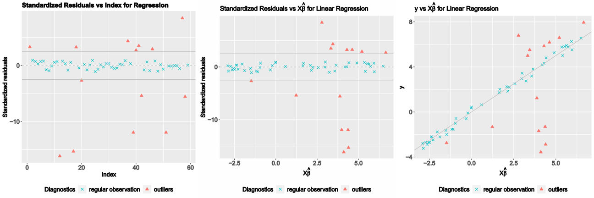

# enetLTS: Robust and Sparse Methods for High Dimensional Linear and Binary and Multinomial Regression

## Summary

`enetLTS` is an `R` package that provides a fully robust version of 
elastic net estimator for high dimensional linear and binary and multinomial regression. 
The elastic net penalization provides 
intrinsic variable selection and coefficient estimates for highly correlated 
variables in particular for high-dimensional low sample size 
data sets, and it has been extended to generalized linear regression models 
([Friedman et al., 2010](https://www.jstatsoft.org/article/download/v033i01/361)). 
Combining these advantages with trimming idea yields the robust solutions.
The main idea of the algorithm is to search for outlier-free subsets on which the classical elastic 
net estimator can be applied. Outlier-free subsets are determined by trimming 
the penalized log-likelihood function belonging to the regression model. 
The algorithm starts with 500 elemental subsets
only for one combination of $\alpha$ and $\lambda$, and takes the *warm start* strategy
for subsequent combinations in order to save the computation time.
The final reweighting step is added to improve the statistical 
efficiency of the proposed methods. 
From this point of view, the enet-LTS estimator can be seen as trimmed version 
of the elastic net regression estimator for linear, binary and multinomial 
regression ([Friedman et al., 2010](https://www.jstatsoft.org/article/download/v033i01/361)). 
Selecting optimal model with optimal tuning parameters is done via cross-validation, 
and various plots are available to illustrate model and to evaluate the 
final model estimates. 

## Implemented Methods 

- `enetLTS()`: elastic net trimmed squared regression for families:

   1- `gaussian`

   2- `binomial`
   
   3- `multinomial`
                                                                  

## Installation

Package `enetLTS` is on CRAN (The Comprehensive `R` Archive Network), hence the latest release can be easily installed from the `R` command as follows

```R
> install.packages("enetLTS")
```

## Building from source

To install the latest (possibly unstable) version from GitHub, you can pull this repository and install it from the `R` command line as follows

```R
> install.packages("devtools")
> devtools::install_github("fatmasevinck/enetLTS")
```

If you already have package `devtools` installed, the first line can be skipped.


# Example: Robust and Sparse Linear Regression

We have considered the [NCI-60 cancer cell panel](https://discover.nci.nih.gov/cellminer/) data in order to illustrate the functionality of the `enetLTS` model for linear regression. As in ([Alfons, 2021](https://joss.theoj.org/papers/10.21105/joss.03786)), the response variable is determined by the protein expressions for a specific protein, which is 92th protein, and
the explanatory variable is determined by the gene expressions of the 100 genes that have the highest (robustly estimated) correlations with the response variable. This data set is available in package `robustHD`.

```R
> # load data
> library("robustHD")
> data("nci60")  # contains matrices 'protein' and 'gene'

> # define response variable
> y <- protein[, 92]
> # screen most correlated predictor variables
> correlations <- apply(gene, 2, corHuber, y)
> keep <- partialOrder(abs(correlations), 100, decreasing = TRUE)
> X <- gene[, keep]
```

Like many other packages, the easy way to use the package `enetLTS` is to install it directly from `CRAN`. 

```R
> # install and load package
> install.packages("enetLTS")
> library(enetLTS)
> # fit the model for family="gaussian"
> fit.gaussian <- enetLTS(X,y)
> [1] "optimal model: lambda = 0.1391 alpha = 0.6"
>
> fit.gaussian
enetLTS estimator 

Call:  enetLTS(xx = X, yy = y, family = "gaussian", alphas = alphas,      
 lambdas = lambdas, lambdaw = NULL, intercept = TRUE, scal = TRUE,      
 hsize = 0.75, nsamp = 500, nCsteps = 20, nfold = 5, repl = 1,      
 ncores = 1, tol = -1e+06, seed = NULL, crit.plot = TRUE) 


Coefficients:
           1            2            3            4            5 
-5.227875054  0.240931448  0.000000000  0.116076316  0.027573388 
           6            7            8            9           10 
 0.000000000  0.000000000  0.000000000  0.000000000  0.041368849 
          11           12           13           14           15 
 0.000000000  0.000000000  0.032874491  0.000000000  0.000000000 
          16           17           18           19           20 
 0.000000000  0.000000000  0.391369317  0.053524802  0.000000000 
          21           22           23           24           25 
 0.000000000  0.000000000  0.000000000  0.028517873 -0.257094024 
          26           27           28           29           30 
 0.000000000  0.000000000  0.000000000 -0.095686659  0.000000000 
          31           32           33           34           35 
 0.000000000  0.000000000  0.093010871  0.000000000  0.000000000 
          36           37           38           39           40 
 0.000000000  0.000000000  0.000000000  0.055097698 -0.158542779 
          41           42           43           44           45 
 0.000000000  0.000000000  0.000000000  0.000000000  0.000000000 
          46           47           48           49           50 
 0.000000000 -0.042666773  0.000000000  0.000000000  0.000000000 
          51           52           53           54           55 
 0.000000000  0.000000000  0.000000000  0.000000000  0.000000000 
          56           57           58           59           60 
 0.000000000  0.000000000  0.000000000  0.000000000  0.000000000 
          61           62           63           64           65 
 0.000000000  0.000000000  0.000000000 -0.013522905  0.000000000 
          66           67           68           69           70 
 0.000000000  0.000000000  0.000000000  0.129058794  0.000000000 
          71           72           73           74           75 
 0.088705925  0.000000000  0.097641709  0.082569621  0.000000000 
          76           77           78           79           80 
 0.000000000  0.111312062  0.000000000  0.000000000  0.000000000 
          81           82           83           84           85 
 0.000000000  0.000000000  0.000000000  0.000000000  0.119835636 
          86           87           88           89           90 
-0.046678268  0.000000000 -0.049993645  0.000000000  0.000000000 
          91           92           93           94           95 
 0.005319332  0.183509787  0.000000000  0.000000000  0.000000000 
          96           97           98           99          100 
-0.002034250  0.000000000  0.000000000  0.040520680  0.000000000 
         101 
 0.030654977 

 number of the nonzero coefficients:
[1] 29

 alpha: 0.6
 lambda: 0.1391
 lambdaw: 0.07545663
```

Several plots are available for the results: `plotCoef.enetLTS()` visualizes the coefficients, 
`plotResid.enetLTS()` plots the values of residuals vs fitted values, 
and `plotDiagnostic.enetLTS()` allows to produce various diagnostic
plots for the final model fit. 
Examples of these plots are shown in Figure \ref{fig:plotexamples}.



# Example: Robust and Sparse Binary Regression 

# Example: Robust and Sparse Multinomial Regression

# References 

Friedman J., Hastie T. and Tibshirani R. (2010) Regularization paths for generalized linear models via coordinate descent. Journal of Statistical Software, 33(1), 1-22. DOI
[10.1163/ej.9789004178922.i-328.7](https://www.jstatsoft.org/article/download/v033i01/361)

Reinhold, W. C., Sunshine, M., Liu, H., Varma, S., Kohn, K. W., Morris, J., Doroshow, J., &
Pommier, Y. (2012). CellMiner: A web-based suite of genomic and pharmacologic tools to
explore transcript and drug patterns in the NCI-60 cell line set. Cancer Research, 72(14),
3499–3511. DOI
[10.1158/0008-5472.can-12-1370](https://pubmed.ncbi.nlm.nih.gov/22802077/)

A. Alfons (2021). robustHD: An R package for robust regression with high-dimensional data. 
Journal of Open Source Software, 6(67), 3786. DOI
[10.21105/joss.03786](https://joss.theoj.org/papers/10.21105/joss.03786)
