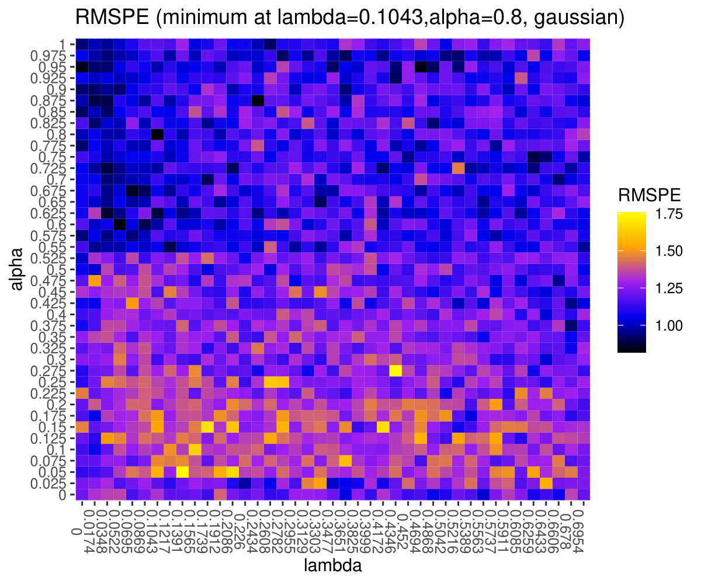

# enetLTS: Robust and Sparse Methods for High Dimensional Linear and Binary and Multinomial Regression

## Summary

`enetLTS` is an `R` package that provides a fully robust version of elastic net estimator for high dimensional linear and binary and multinomial regression. The elastic net penalization provides intrinsic variable selection and coefficient estimates for highly correlated variables in particular for high-dimensional low sample size data sets, and it has been extended to generalized linear regression models ([Friedman et al., 2010](https://www.jstatsoft.org/article/download/v033i01/361)). Combining these advantages with trimming idea yields the robust solutions. The main idea of the algorithm is to search for outlier-free subsets on which the classical elastic net estimator can be applied. Outlier-free subsets are determined by trimming the penalized log-likelihood function belonging to the regression model. The algorithm starts with 500 elemental subsets only for one combination of $\alpha$ and $\lambda$, and takes the *warm start* strategy for subsequent combinations in order to save the computation time. The final reweighting step is added to improve the statistical efficiency of the proposed methods. From this point of view, the enet-LTS estimator can be seen as trimmed version of the elastic net regression estimator for linear, binary and multinomial regression ([Friedman et al., 2010](https://www.jstatsoft.org/article/download/v033i01/361)). Selecting optimal model with optimal tuning parameters is done via cross-validation, and various plots are available to illustrate model and to evaluate the final model estimates. 

## Implemented Methods 

- `enetLTS()`: elastic net trimmed squared regression for families:

   1- `gaussian`

   2- `binomial`
   
   3- `multinomial`
                                                                  

## Installation

Package `enetLTS` is on CRAN (The Comprehensive `R` Archive Network), hence the latest release can be easily installed from the `R` command as follows

```R
> install.packages("enetLTS")
```

## Building from source

To install the latest (possibly unstable) version from GitHub, you can pull this repository and install it from the `R` command line as follows

```R
> install.packages("devtools")
> devtools::install_github("fatmasevinck/enetLTS")
```

If you already have package `devtools` installed, the first line can be skipped.


# Example: Robust and Sparse Linear Regression (`family="gaussian"`)

We have considered the [NCI-60 cancer cell panel](https://discover.nci.nih.gov/cellminer/) data in order to illustrate the functionality of the `enetLTS` model for linear regression. As in package `robustHD` ([Alfons, 2021](https://joss.theoj.org/papers/10.21105/joss.03786)), the response variable is determined by the protein expressions for a specific protein, which is 92th protein, and the explanatory variable is determined by the gene expressions of the 100 genes that have the highest (robustly estimated) correlations with the response variable. This data set is available in package `robustHD`.

```R
> # load data
> library("robustHD")
> data("nci60")  # contains matrices 'protein' and 'gene'
>
> # define response variable
> y <- protein[, 92]
> # screen most correlated predictor variables
> correlations <- apply(gene, 2, corHuber, y)
> keep <- partialOrder(abs(correlations), 100, decreasing = TRUE)
> X <- gene[, keep]
```

Like many other packages, the easy way to use the package `enetLTS` is to install it directly from `CRAN`. The default `family` option is `gaussian`.

```R
> # install and load package
> install.packages("enetLTS")
> library(enetLTS)
> # fit the model for family="gaussian"
> fit.gaussian <- enetLTS(X,y)
> [1] "optimal model: lambda = 0.1391 alpha = 0.6"
>
> fit.gaussian
enetLTS estimator 

Call:  enetLTS(xx = X, yy = y, family = "gaussian", alphas = alphas, lambdas = lambdas, lambdaw = NULL, intercept = TRUE, scal = TRUE, 
 hsize = 0.75, nsamp = 500, nCsteps = 20, nfold = 5, repl = 1, ncores = 1, tol = -1e+06, seed = NULL, crit.plot = TRUE) 

 number of the nonzero coefficients:
[1] 29

 alpha: 0.6
 lambda: 0.1391
 lambdaw: 0.07545663
```
 
The main function `enetLTS()` provides user supplied option for alpha sequence for the elastic net penalty, which is the mixing proportion of the ridge and lasso penalties and takes value in $[0,1]$. $\alpha=1$ is the lasso penalty, and $\alpha=0$ the ridge penalty. If not provided a sequence, default is 41 equally spaced values. For the other tuning parameter $\lambda$ that keeps the strength of the elastic net penalty, user supplied sequence is available. If not provided a sequence, default is chosen with steps of size -0.025 lambda0 with $0\le\lambda\le lambda0$ for linear regression, where lambda0 is determined as in ([Alfons, 2021](https://joss.theoj.org/papers/10.21105/joss.03786)). 

The arguman `hsize` shows a numeric value giving the percentage of the trimming of the penalized objective function of current family with default 0.75. 

The arguman `nsamp` is a numeric vector giving the number of subsamples which has two entries. The first element gives the number of initial subsamples to be used. The second element gives the number of subsamples to keep after the started ncstep C-steps. For those remaining subsets, additional C-steps are performed until convergence. The default is to start with ncstep C-steps on 500 initial subsamples for first combination of tuning parameters $\alpha$ and $\lambda$, and then to keep the 10 subsamples with the lowest value of the objective function for additional C-steps until convergence. For the next combination of tuning parameters $\alpha$ and $\lambda$, the algorithm took the $warm start$ idea, which means the best subset of neighboring grid value is taken, and C-steps are started from this best subset until convergence. The `nsamp` entries can be determined by users. 

After computed all candidate best subsets based on certain grids for $\alpha$ and $\lambda$, the combination of the optimal tuning parameters is defined by 5-fold cross-validation. Evaluation criterion for 5-fold cross-validation is summarized by heatmap for users if the arguman is chosen as `crit.plot="TRUE"`. 



To determine updated parameter $\lambda$ (`lambdaw`) in reweighting step, we have considered 5-fold cross-validation based on the `cv.glmnet()` function from `glmnet` [(Friedman et al., 2021)](https://CRAN.R-project.org/package=glmnet). 

Several plots are available for the results: `plotCoef.enetLTS()` visualizes the coefficients, `plotResid.enetLTS()` plots the values of residuals vs fitted values, and `plotDiagnostic.enetLTS()` allows to produce various diagnostic plots for the final model fit. Some of them are as follows:


Examples of the residuals plot (left) and the diagnostic plot (right) for output of function `enetLTS()` with the arguman `family="gaussian"`.

# Example: Robust and Sparse Binary Regression (`family="binomial"`)

In order to provide an example for binary regression, we simulate the data and apply the `enetLTS()`function with the option `family="binomial"`.

```R
> # install and load package
> install.packages("enetLTS")
> library(enetLTS)
> # fit the model for family="binomial"
> fit.binomial <- enetLTS(Xout, yout, family="binomial", alphas=alphas, lambdas=lambdas)
> fit.binomial
enetLTS estimator 

Call:  enetLTS(xx = Xout, yy = yout, family = "binomial", alphas = alphas, lambdas = lambdas, lambdaw = NULL, intercept = TRUE, scal = TRUE, 
 hsize = 0.75, nsamp = c(500, 10), nCsteps = 20, nfold = 5, repl = 1, ncores = 1, tol = -1e+06, seed = NULL, crit.plot = TRUE) 

 number of the nonzero coefficients:
[1] 34

 alpha: 0.65
 lambda: 0.0023
 lambdaw: 0.02225821
```

Similarly, in binary case, the main function `enetLTS()` provides user supplied option for alpha sequence for the elastic net penalty. If not provided a sequence, default is 41 equally spaced values between 0 and 1. For the tuning parameter $\lambda$, user supplied sequence is available. If not provided a sequence, default is chosen with steps of size -0.025 lambda00 with $0\le\lambda\le$lambda00 for binary regression. lambda0 is determined based on the Pearson correlation between y and the jth predictor variable x_j on winsorized data for linear regression. In lambda00 for logistic regression, the Pearson correlation is replaced by a robustified point-biserial correlation, see ([Kurnaz et al., 2018](https://www.sciencedirect.com/science/article/pii/S0169743917301247)). 

As in `family="gaussian"`, the combination of the optimal tuning parameters is defined by 5-fold cross-validation based on certain grids for $\alpha$ and $\lambda$ for `family="binomial"`. In order to show evaluation criterion for 5-fold cross-validation via heatmap, the arguman `crit.plot` should be assigned to `"TRUE"`. To determine updated parameter $\lambda$ (`lambdaw`) for reweighting step, we have considered 5-fold cross-validation based on the `cv.glmnet()` function from `glmnet` package for current `family` option. `plotCoef.enetLTS()` includes the coefficients. Plot functions are re-organized to be suitable for binary regression. In `plotResid.enetLTS()`, residuals are turned into the deviances in binary regression case and this plot function produces two plots which are deviances vs index and deviances vs fitted values (link function). `plotDiagnostic.enetLTS()` shows the response variable vs fitted values (link function). Some of these plots are demonstrated as follows.


# Example: Robust and Sparse Multinomial Regression (`family="multinomial"`)

The fuit data set has been well-known in the context of robust discrimination. It contains spectral information with 256 wavelengths, thus is high-dimensional, for observations from 3 different cultivars of the same fruit, named D, M, and HA, with group sizes 490, 106, and 500. This data set is available in R package `rrcov`.

```R
> # load data
> library(rrcov)
> data(fruit)
> 
> d <- fruit[,-1]  # first column includes the fruid names 
> X <- as.matrix(d)
> # define response variable
> grp <- c(rep(1,490),rep(2,106),rep(3,500)) 
> y <- factor(grp-1)
```
With `family="multinomial"`, the model `enetLTS()` produces the results of multinomial regression.

```R
> fit.multinom <- enetLTS(X, y, family="multinomial", lambdas=seq(from=0.01,to=0.1,by=0.01), crit.plot=FALSE)
> [1] "optimal model: lambda = 0.01 alpha = 0.02"
> 
> fit.mutinom 
enetLTS estimator 

Call:  enetLTS(xx = xx, yy = yy, family = "multinomial", alphas = alphas, lambdas = lambdas, lambdaw = NULL, intercept = TRUE, scal = TRUE, hsize = 0.75, nsamp = c(500, 10), nCsteps = 20, nfold = 5, repl = 1, ncores = 1, tol = -1e+06, seed = NULL, crit.plot = FALSE) 

 number of the nonzero coefficients:
[1] 704

 alpha: 0.02
 lambda: 0.01
 lambdaw: 0.003971358
  ```    

Similar to previous families, the main function `enetLTS()` provides user supplied option for alpha sequence for the elastic net penalty. If not provided a sequence, default is 41 equally spaced values. For the tuning parameter $\lambda$, user supplied sequence is available. If not provided a sequence, 
default is chosen with steps of size -0.05 from 0.95 to 0.05 for multinomial regression, see ([Kurnaz and Filzmoser, 2022](https://arxiv.org/pdf/2205.11835.pdf)). 

The combination of the optimal tuning parameters is defined by 5-fold cross-validation based on certain grids for $\alpha$ and $\lambda$. In order to show evaluation criterion for 5-fold cross-validation via heatmap, the arguman `crit.plot` should be assigned to `"TRUE"`. To determine updated parameter $\lambda$ (`lambdaw`) for reweighting step, we have considered 5-fold cross-validation based on the `cv.glmnet()` function from package `glmnet` [(Friedman et al., 2021)](https://CRAN.R-project.org/package=glmnet) for current `family` option. `plotCoef.enetLTS()` includes group information for multinomial regression. Plot functions are re-organized to be suitable for multinomial regression. In `plotResid.enetLTS()`, residuals are turned into the deviances as in binary regression case. `plotDiagnostic.enetLTS()` shows the scores of all groups in the space of the first two principal components, explaining nearly all of the variability. These plots are demonstrated as follows.


 
 
 
 
# References 

A. Alfons (2021). robustHD: An R package for robust regression with high-dimensional data. 
Journal of Open Source Software, 6(67), 3786. DOI
[10.21105/joss.03786](https://joss.theoj.org/papers/10.21105/joss.03786)

Friedman J., Hastie T. and Tibshirani R. (2010). Regularization paths for generalized linear 
models via coordinate descent. Journal of Statistical Software, 33(1), 1-22. DOI
[10.1163/ej.9789004178922.i-328.7](https://www.jstatsoft.org/article/download/v033i01/361)

J. Friedman and T. Hastie and R. Tibshirani and B. Narasimhan and K. Tay and N. Simon and J. Qian and J. Yang (2021).
glmnet: Lasso and Elastic-Net Regularized Generalized Linear Models. R Foundation for Statistical Computing, Vienna, Austria. R package version 4.1--3 
(https://CRAN.R-project.org/package=glmnet)

F. S. Kurnaz and I. Hoffmann and P. Filzmoser (2018). Robust and sparse estimation methods for high-dimensional linear and logistic regression. Chemometrics and Intelligent Laboratory Systems, 172, 211-222. DOI
[10.1016/j.chemolab.2017.11.017"](https://www.sciencedirect.com/science/article/pii/S0169743917301247)
    
F. S. Kurnaz and P. Filzmoser (2022). Robust and Sparse Multinomial Regression in High Dimensions. DOI
    [10.48550/arXiv.2205.11835](https://arxiv.org/pdf/2205.11835.pdf)
   
Reinhold, W. C., Sunshine, M., Liu, H., Varma, S., Kohn, K. W., Morris, J., Doroshow, J., &
Pommier, Y. (2012). CellMiner: A web-based suite of genomic and pharmacologic tools to
explore transcript and drug patterns in the NCI-60 cell line set. Cancer Research, 72(14),
3499–3511. DOI
[10.1158/0008-5472.can-12-1370](https://pubmed.ncbi.nlm.nih.gov/22802077/)

