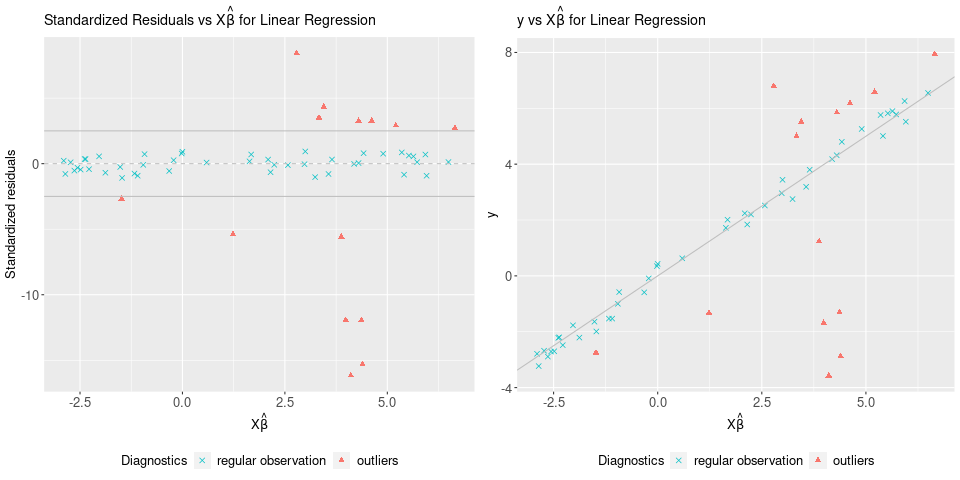
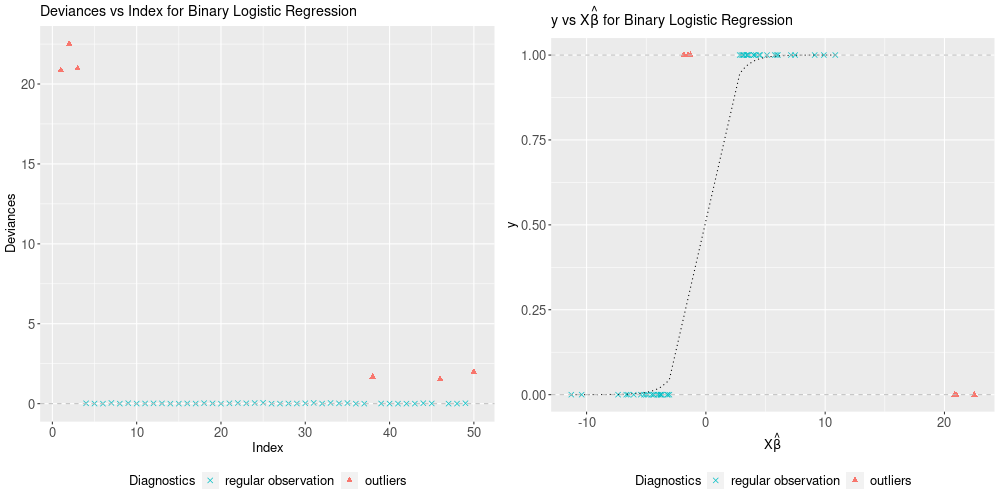

# Summary

`enetLTS` is an `R` package [@R21] that provides a fully robust version of elastic net estimator for high dimensional linear and binary and multinomial regression. The elastic net penalization provides intrinsic variable selection and coefficient estimates for highly correlated variables in particular for high-dimensional low sample size data sets, and it has been extended to generalized linear regression models [@Friedman10]. Combining these advantages with trimming idea yields the robust solutions. The main idea of the algorithm is to search for outlier-free subsets on which the classical elastic net estimator can be applied. Outlier-free subsets are determined by trimming the penalized log-likelihood function belonging to the regression model. The algorithm starts with 500 elemental subsets only for one combination of $\alpha$ and $\lambda$, and takes the *warm start* strategy for subsequent combinations in order to save the computation time. The final reweighting step is added to improve the statistical efficiency of the proposed methods. From this point of view, the enet-LTS estimator can be seen as trimmed version of the elastic net regression estimator for linear, binary and multinomial regression [@Friedman10]. Selecting optimal model with optimal tuning parameters is done via cross-validation, and various plots are available to illustrate model selection and to evaluate the final model estimates. 


# State of the field

# Statement of need

A number of new robust linear regression methods have been developed during the last decade to improve the calculation for high dimensional linear regression, such as [@Alfons21R; @Keplinger21R]. However, to the best of our knowledge, the robust logistic (both binary and multinomial) regression for high dimensional data is not available in elsewhere. Package `enetLTS` therefore provides researchers with access to robust solutions and variable selection at the same time with high-dimensional linear and logistic regression data. It has been used in many benchmarking studies in the statistical literature e.g. [@Insolia21b; @Insolia21a; @Monti21], as well as in empirical research e.g. [@Segaert18; @Jensch22].


# Example: Robust and Sparse Linear Regression (`family="gaussian"`)

We have considered the [NCI-60 cancer cell panel](https://discover.nci.nih.gov/cellminer/) data [@Reinhold12] in order to illustrate the functionality of the `enetLTS` model for linear regression. As in [@Alfons21R] the response variable is determined by the protein expressions for a specific protein, which is 92th protein, and the explanatory variable is determined by the gene expressions of the 100 genes that have the highest (robustly estimated) correlations with the response variable. This data set is available in package `robustHD`. 

```R
> # load data
> library("robustHD")
> data("nci60")  # contains matrices 'protein' and 'gene'

> # define response variable
> y <- protein[, 92]
> # screen most correlated predictor variables
> correlations <- apply(gene, 2, corHuber, y)
> keep <- partialOrder(abs(correlations), 100, decreasing = TRUE)
> X <- gene[, keep]
```

Like many other packages, the easy way to use the package `enetLTS` is to install it directly from `CRAN`. The default `family` option is `gaussian`.

```R
> # install and load package
> install.packages("enetLTS")
> library(enetLTS)
> # fit the model for family="gaussian"
> fit.gaussian <- enetLTS(X,y)
> [1] "optimal model: lambda = 0.1391 alpha = 0.6"
>
> fit.gaussian
enetLTS estimator 

Call:  enetLTS(xx = X, yy = y, family = "gaussian", alphas = alphas, 
 lambdas = lambdas, lambdaw = NULL, intercept = TRUE, scal = TRUE, 
 hsize = 0.75, nsamp = 500, nCsteps = 20, nfold = 5, repl = 1, 
 ncores = 1, tol = -1e+06, seed = NULL, crit.plot = TRUE) 

 number of the nonzero coefficients:
[1] 29

 alpha: 0.6
 lambda: 0.1391
 lambdaw: 0.07545663
```

The arguman `hsize` shows a numeric value giving the percentage of the trimming of the penalized objective function. The default value is 0.75. The arguman `nsamp` is a numeric vector giving the number of subsamples which has two entries. The first element gives the number of initial subsamples to be used. The second element gives the number of subsamples to keep after the started ncstep C-steps. For those remaining subsets, additional C-steps are performed until convergence. The default is to start with ncstep C-steps on 500 initial subsamples for first combination of tuning parameters $\alpha$ and $\lambda$, and then to keep the 10 subsamples with the lowest value of the objective function for additional C-steps until convergence. For the next combination of tuning parameters $\alpha$ and $\lambda$, the algorithm took the $warm start$ idea, which means the best subset of neighboring grid value is taken, and C-steps are started from this best subset until convergence. The `nsamp` entries can also supplied by users. These argumans are the same for the other family options.  

The main function `enetLTS()` provides user supplied option for alpha sequence for the elastic net penalty. If not provided a sequence, default is 41 equally spaced values. For the other tuning parameter $\lambda$ that keeps the strength of the elastic net penalty, user supplied sequence is available. If not provided a sequence, the default for `family="gaussian"` is chosen with steps of size -0.025 lambda0 with $0\le\lambda\le$lambda0, where lambda0 is determined as in [@Alfons21R]. 


After computed all candidate best subsets based on certain grids of $\alpha$ and $\lambda$, the combination of the optimal tuning parameters is defined by 5-fold cross-validation. Evaluation criterion for 5-fold cross-validation is summarized by heatmap for users if the arguman is chosen as `crit.plot="TRUE"`. 


To determine updated parameter $\lambda$ (`lambdaw`) in reweighting step, we have considered 5-fold cross-validation based on the `cv.glmnet()` function from `glmnet` [@Friedman21R]. 

Several plots are available for the results: `plotCoef.enetLTS()` visualizes the coefficients where the sparsity can be shown clearly, `plotResid.enetLTS()` plots the values of residuals vs fitted values, and `plotDiagnostic.enetLTS()` allows to produce various diagnostic plots for the final model fit. Some examples of these plots are shown in Figure \ref{fig:plotexamplesGuas}.




# Example: Robust and Sparse Binary Regression \ (`family="binomial"`)

In order to provide an example for binary regression, we simulate the data and apply the `enetLTS()`function with the option `family="binomial"`.

```R
>
> !!! I am aware that the outliers are very extremeeeee, I will work on simulated data and ... !!!!!
>
> 
> 
> # fit the model for family="binomial"
> fit.binomial <- enetLTS(Xout, yout, family="binomial")
> fit.binomial
enetLTS estimator 

Call:  enetLTS(xx = Xout, yy = yout, family = "binomial", alphas = alphas, 
 lambdas = lambdas, lambdaw = NULL, intercept = TRUE, scal = TRUE, 
 hsize = 0.75, nsamp = c(500, 10), nCsteps = 20, nfold = 5, repl = 1, 
 ncores = 1, tol = -1e+06, seed = NULL, crit.plot = TRUE) 

 number of the nonzero coefficients:
[1] 34

 alpha: 0.65
 lambda: 0.0023
 lambdaw: 0.02225821
```

Similarly, in binary case, the main function `enetLTS()` provides user supplied option for alpha sequence for the elastic net penalty. If not provided a sequence, default is 41 equally spaced values. For the tuning parameter $\lambda$, user supplied sequence is available. If not provided a sequence, default is chosen with steps of size -0.025 lambda00 with $0\le\lambda\le$lambda00 for binary regression, where lambda00 is determined based on the robustified point-biserial correlation, see [@Kurnaz18].

As in `family="gaussian"`, the combination of the optimal tuning parameters is defined by 5-fold cross-validation based on certain grids for $\alpha$ and $\lambda$ for `family="binomial"`. In order to show evaluation criterion for 5-fold cross-validation via heatmap, the arguman `crit.plot` should be assigned to `"TRUE"`. 
To determine updated parameter $\lambda$ (`lambdaw`) for reweighting step, we have considered 5-fold cross-validation based on the `cv.glmnet()` function from `glmnet` package for current `family` option. 

Plot functions are re-organized to be suitable for binary regression. In `plotResid.enetLTS()`, residuals are turned into the deviances and this plot function produces two plots which are deviances vs index and deviances vs fitted values (link function). `plotDiagnostic.enetLTS()` shows the response variable vs fitted values (link function). Some of these plots are demonstrated in Figure \ref{fig:coefbinom} and \ref{fig:ResidDiagbinom}.





# Example: Robust and Sparse Multinomial Regression \ (`family="multinomial"`)

The fuit data set has been well-known in the context of robust discrimination. It contains spectral information with 256 wavelengths, thus is high-dimensional, for observations from 3 different cultivars of the same fruit, named D, M, and HA, with group sizes 490, 106, and 500. This data set is available in R package `rrcov` and it is taken into consideration to illustrate the functionality of the `enetLTS` model for multinomial regression.

```R
> # load data
> library(rrcov)
> data(fruit)
> 
> d <- fruit[,-1]  # first column includes the fruid names 
> X <- as.matrix(d)
> # define response variable
> grp <- c(rep(1,490),rep(2,106),rep(3,500)) 
> y <- factor(grp-1)
```
With `family="multinomial"`, the model `enetLTS()` produces the results of multinomial regression. Here user supplied values of `lambdas` are considered. 

```R
> lambdas=seq(from=0.01,to=0.1,by=0.01)
> fit.multinom <- enetLTS(X, y, family="multinomial", 
  lambdas=lambdas, crit.plot=FALSE)
> [1] "optimal model: lambda = 0.01 alpha = 0.02"
> 
> fit.mutinom 
enetLTS estimator 

Call:  enetLTS(xx = xx, yy = yy, family = "multinomial", alphas = alphas, 
 lambdas = lambdas, lambdaw = NULL, intercept = TRUE, scal = TRUE, 
 hsize = 0.75, nsamp = c(500, 10), nCsteps = 20, nfold = 5, repl = 1, 
 ncores = 1, tol = -1e+06, seed = NULL, crit.plot = FALSE) 

 number of the nonzero coefficients:
[1] 704

 alpha: 0.02
 lambda: 0.01
 lambdaw: 0.003971358
  ```    

The main function `enetLTS()` provides similar options for alpha sequence for the elastic net penalty. As for the tuning parameter $\lambda$, if user does not provided a sequence, default is chosen with steps of size -0.05 from 0.95 to 0.05 for multinomial regression, see [@Kurnaz22Arx]. 

The combination of the optimal tuning parameters is defined by 5-fold cross-validation based on certain grids for $\alpha$ and $\lambda$. In order to show evaluation criterion for 5-fold cross-validation via heatmap, the arguman `crit.plot` should be assigned to `"TRUE"`. 
Updated tuning parameter $\lambda$ (`lambdaw`) for reweighting step is done using the `cv.glmnet()` function from package `glmnet` [@Friedman21R] with `family="multinomial"` option. 
Plot functions are re-organized to be suitable for multinomial regression. `plotCoef.enetLTS()` includes group information for multinomial regression. In `plotResid.enetLTS()`, residuals are turned into the deviances as in binary regression case. `plotDiagnostic.enetLTS()` shows the scores of all groups in the space of the first two principal components, explaining nearly all of the variability. 


# Related Software

Package `robustHD` provides the sparseLTS estimator for linear regression based on the trimming idea for high dimensional linear regression [@Alfons21R]. Package `pense` provides implementations of robust S- and MM-type estimators using elastic net
regularization for linear regression [@Keplinger21R]. Package `glmnet` implements the elastic net estimator for generalized linear regression models [@Friedman21R]. Moreover, the procedure of the R package `enetLTS` [@Kurnaz22Rcran]. is implemented using internally the R package `glmnet` [@Friedman21R].  


# Acknowledgements

Fatma Sevinc KURNAZ is supported by grant TUBITAK 2219 from Scientific and Technological Research Council of Turkey (TUBITAK). 


# References
